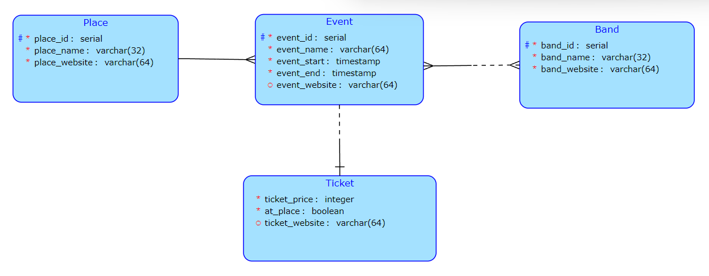
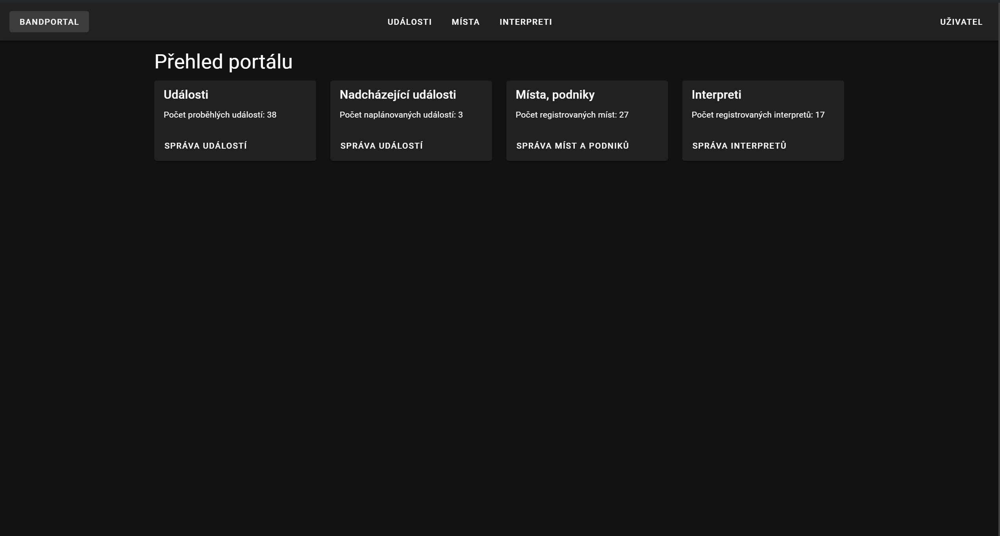
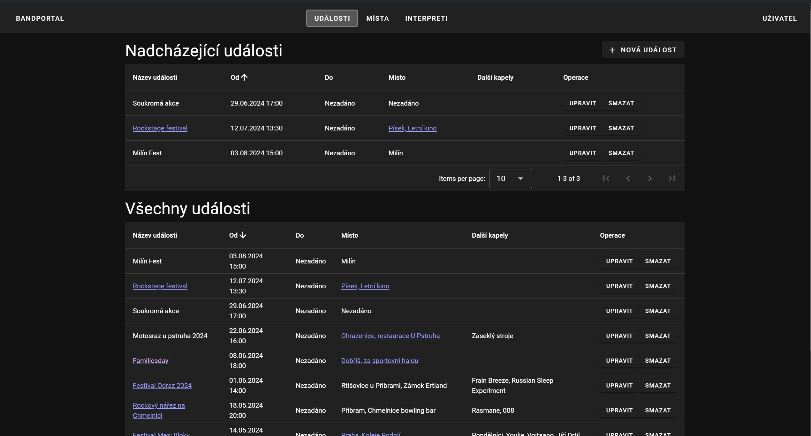

# Bandportal
*Band booking management system, my semestral work for subject BI-KOT*

## DB Diagram

*(It is an old version, some property types may be changed)*

## Technologies used

### Backend
- Gradle
- Kotlin
- Ktor (Web App Framework)
- Exposed (Working with DB)

### Frontend
- npm
- TypeScript
- Vue.js
- Vuetify (Material Design Library)

## Screenshots

## Old version
Old version (Spring boot + React) could be found at [1vishmusic's github](https://github.com/1vishmusic/bandportal-bootstrap) ([frontend](https://github.com/1vishmusic/bandportal-dashboard), [backend](https://github.com/1vishmusic/bandportal-java))