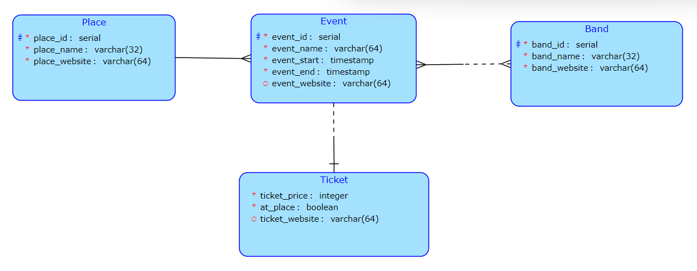

# Nový backend k projektu Bandportal
*Semestrální práce k předmětu BI-KOT*

Jedná se o systém databáze koncertů kapely, ve kterém bude jednoduše možné vytvářet a upravovat koncerty. Hlavním výstupem z tohoto systému by měla být api, ze které se snadno vygeneruje seznam koncertů pro oficiální stránky kapely, a dále api díky kterému bude možné tento seznam upravovat.

## Databázový diagram
*(Jedná se o diagram z první Spring verze, některé typy mohly být poupraveny, nicméně vazby by měly zůstat stejné)*

