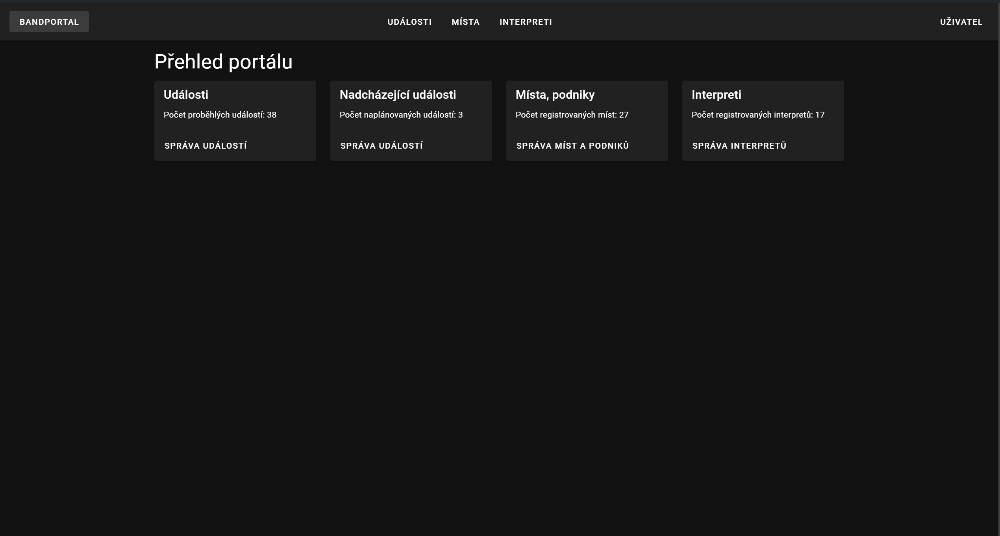
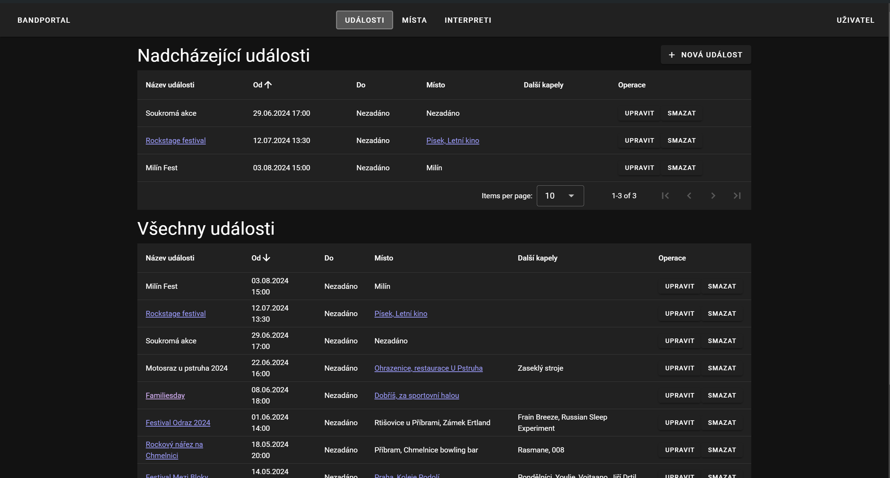
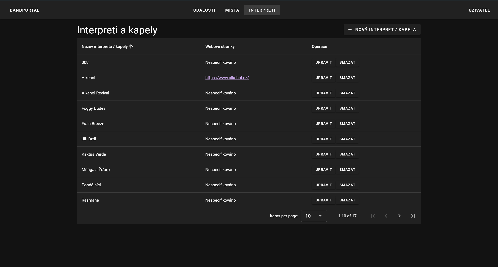

# Nový frontend k projektu bandportal
Jedná se o systém databáze koncertů kapely, ve kterém bude jednoduše možné vytvářet a upravovat koncerty.
Hlavním výstupem z tohoto systému by mělo být uživatlsky přívětivé UI sloužící k plánování kapelních akcí.

Frontend komunikuje s backendem napsaným v Kotlinu ve frameworku Ktor.

## Použité technologie
- npm
- TypeScript
- Vue.js - Framework
- Vuetify - Knihovna Material Design komponent

## Ukázky

